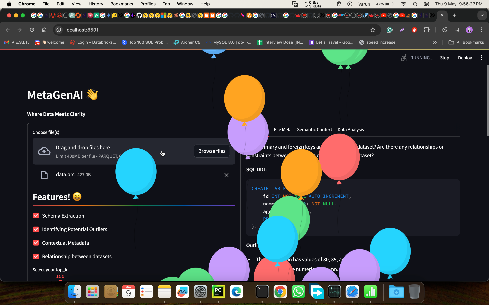
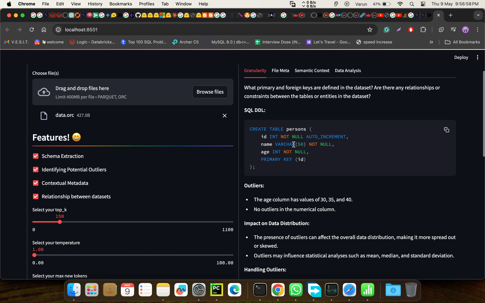
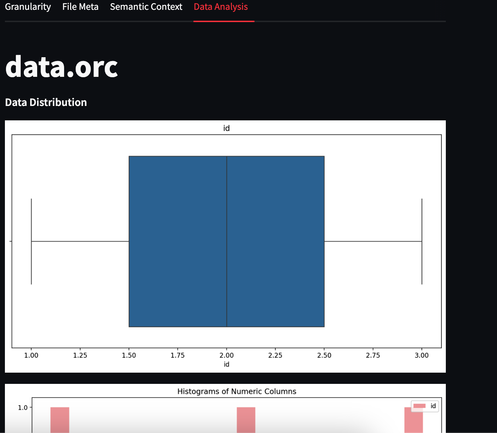

# MetaGenAI 👋
Where Data Meets Clarity
 ## Overview

This repository hosts tools designed to automate the extraction of metadata from datasets, enhancing data understanding and management. Leveraging cutting-edge AI models, our tools provide robust capabilities for schema extraction, outlier identification, contextual metadata generation, skewness detection, and semantic context understanding, specifically tailored for Parquet and ORC file formats.

## Features

Schema Extraction: Automatically extract schemas from datasets to understand their structure and organization.
Outlier Identification: Identify outliers within datasets to ensure data quality and reliability.
Contextual Metadata Generation: Generate rich contextual metadata to provide deeper insights into the data's meaning and context.
Skewness Detection: Detect skewness within datasets, enabling better data distribution understanding.
Semantic Context Understanding: Utilize advanced AI models to understand the semantic context of data, enhancing interpretation and analysis.

### AI Models Used

- Gen AI by OpenAI (google/gemma-1.1-7b-it)

- Meta-Llama (meta-llama/Meta-Llama-3-70B-Instruct)

- NLP

## MetaGenAI UI

## MetaGenAI Granularity UI

## MetaGenAI Data Analysis UI

### Contributions

Contributions to this project are welcome! Whether it's bug fixes, feature enhancements, or documentation improvements, feel free to submit pull requests.

Best Regards, 

Varun Ajmera

